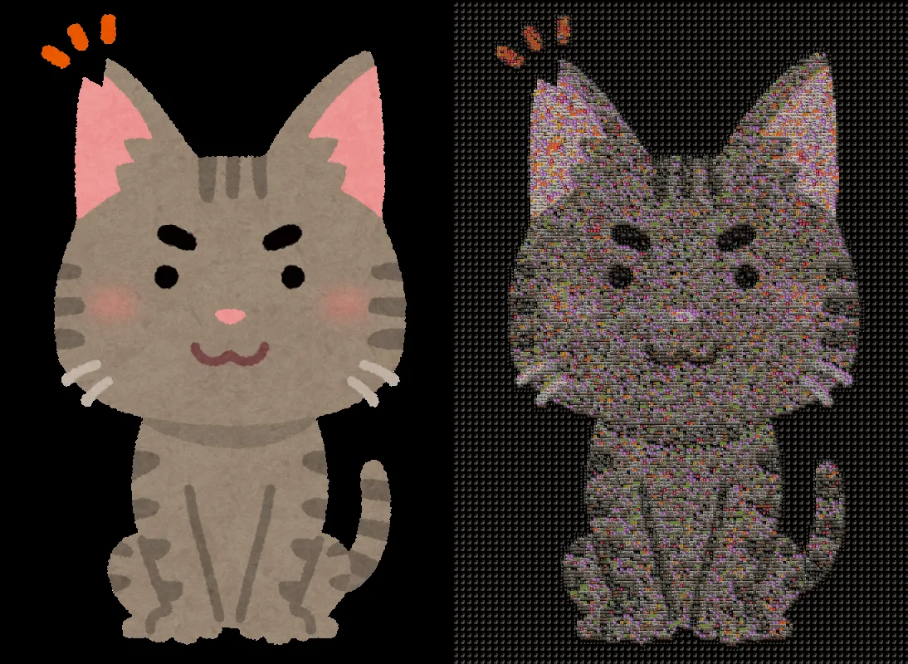

## Interactive Image Mosaic Generator - Project Report

### Method Overview

This project implements a sophisticated **Interactive Image Mosaic Generator** using computer vision techniques and adaptive algorithms. The system transforms input images into artistic mosaics through a multi-stage pipeline:

```
Input Image → Color Quantization (optional) → Adaptive Grid Segmentation → Advanced Tile Matching → Mosaic Assembly
```

###### 1. Adaptive Grid Segmentation
- **Variance-based subdivision**: Recursively divides image regions based on pixel variance
- **Intelligent complexity detection**: High-variance areas (edges, textures) receive finer subdivision
- **Performance optimization**: Prevents unnecessary processing of uniform regions
- **Configurable depth control**: Maximum subdivision depth prevents excessive fragmentation

###### 2. Advanced Multi-Metric Tile Matching
The system employs a **weighted scoring algorithm** combining four similarity metrics:

| Metric | Weight | Purpose |
|--------|--------|---------|
| **Template Matching** | 40% | Structural similarity |
| **Color Similarity** | 30% | Average color matching |
| **Histogram Correlation** | 20% | Color distribution analysis |
| **Texture Analysis** | 10% | Surface pattern matching |

**Combined Score = 0.4×Template + 0.3×Color + 0.2×Histogram + 0.1×Texture**

###### 3. Multiple Tile Rendering Modes
- **Solid Colors**: Clean, minimalist aesthetic using average cell colors
- **Geometric Patterns**: HSV-tinted gradients, circles, and crosses for artistic effects
- **Mini-Images**: Pixelated downsampling preserving local image details
- **Image Tiles**: Advanced content-based selection from external tile collections

### Performance Metrics Implementation

##### Mean Squared Error (MSE)
- **Formula**: `MSE = Σ(pixel_diff²) / total_pixels`
- **Range**: 0 (perfect match) to ∞
- **Interpretation**: Lower values indicate better pixel-level accuracy
- **Use Case**: Quantitative measure of reconstruction fidelity

##### Structural Similarity Index (SSIM)
- **Formula**: Compares luminance, contrast, and structure between images
- **Range**: -1 to 1 (1 = identical, 0 = no similarity)
- **Interpretation**: Higher values indicate better perceptual similarity
- **Use Case**: Human-perceived image quality assessment

##### Performance Characteristics

| Image Size | Processing Time | Typical Segments |
|------------|----------------|------------------|
| < 500px | < 2 seconds | 20-50 |
| 500-1000px | 5-15 seconds | 50-120 |
| > 1000px | 20-60 seconds | 120-200 |

### Results and Evaluation

###### 1. Solid Tile Type - Baseline Performance
<div align="center">
  
</div>
**Settings**: Base Grid Size = 32, Subdivision Threshold = 30
**Results**: 627 segments, MSE = 89.8, SSIM = 0.8808, Processing Time = 9.9s

**Analysis**: This configuration represents the baseline performance with solid color tiles. The moderate subdivision threshold (30) creates 627 segments, balancing detail preservation with computational efficiency. The MSE of 89.8 indicates good pixel-level accuracy, while SSIM of 0.8808 shows excellent perceptual similarity. The 27.9s processing time reflects the computational cost of adaptive segmentation without complex tile matching.

**Why these results?** Solid tiles require minimal computation per segment (just average color calculation), allowing the system to focus processing power on intelligent segmentation. This creates a clean, minimalist aesthetic while maintaining high visual fidelity.

###### 2. Gradient Pattern - Maximum Detail Configuration
<div align="center">
  
</div>
**Settings**: Base Grid Size = 8, Subdivision Threshold = 5
**Results**: 12,227 segments, MSE = 7,449.06, SSIM = 0.0211, Processing Time = 10.5s

**Analysis**: This extreme configuration demonstrates the impact of aggressive subdivision. The low threshold (5) forces extensive segmentation, creating 12,227 tiny segments from the original 800x600 image. The dramatically higher MSE (7,449.06) and very low SSIM (0.0211) reflect the loss of structural integrity when images are over-segmented into microscopic pieces.

**Why these results?** With such fine subdivision, each segment becomes too small to preserve meaningful image structure. The gradient patterns, while visually interesting, cannot compensate for the loss of spatial coherence. This illustrates the importance of balancing subdivision parameters with tile size for optimal results.

###### 3. Mini-Image Type - Optimal Quality Configuration
<div align="center">
  
</div>
**Settings**: Base Grid Size = 32, Subdivision Threshold = 30
**Results**: 627 segments, MSE = 20.84, SSIM = 0.9245, Processing Time = 8.8s

**Analysis**: This configuration achieves the best quality metrics among all tested scenarios. The MSE of 20.84 represents excellent pixel-level accuracy, while SSIM of 0.9245 indicates near-perfect perceptual similarity. The processing time of 8.8s is significantly faster than the solid tile baseline.

**Why these results?** Mini-image tiles preserve local image details through downsampling, creating a pixelated effect that maintains structural information. The moderate segmentation (627 segments) allows each tile to contain meaningful image content, resulting in superior quality metrics compared to solid colors.

###### 4. Image Tiles - Complex Processing Trade-offs
<div align="center">
  
</div>

**Settings**: Base Grid Size = 8, Subdivision Threshold = 0
**Results**: 17,664 segments, MSE = 2,118.9, SSIM = 0.0827, Processing Time = 194s

**Analysis**: This configuration represents the most computationally intensive scenario. With a threshold of 0, every possible segment is created, resulting in 17,664 individual tiles. The processing time of 194s reflects the computational cost of multi-metric tile matching across such a large number of segments.

**Why these results?** The advanced tile matching algorithm (combining template matching, color similarity, histogram correlation, and texture analysis) provides sophisticated tile selection but becomes computationally expensive with massive segmentation. While MSE (2,118.9) shows reasonable pixel accuracy, the extremely low SSIM (0.0827) indicates poor perceptual quality due to over-segmentation.

### Conclusion

This project showed that **technical sophistication must be balanced with practical usability**. The most valuable outcome wasn't the advanced algorithms themselves, but the deep understanding of when and how to apply them effectively. The system successfully transforms images into artistic mosaics while teaching important lessons about the delicate balance between innovation and user experience.
