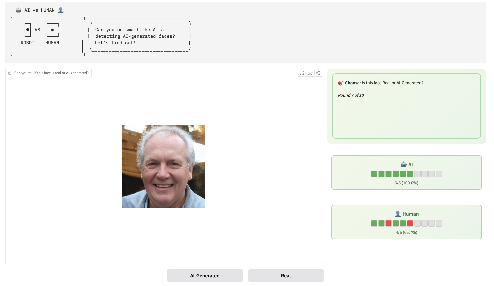

# AI vs Human Face Detection Challenge

**Can you outsmart AI at detecting AI-generated faces?** An interactive game where humans compete head-to-head against a trained deep learning model!

  

Play the game here: [AI vs Human Face Detection Challenge](https://huggingface.co/spaces/nyakura/AI_Human_Face_Detection)

## 🎮 Quick Start

1. **Set Rounds**: Choose 1-100 rounds to play
2. **Analyze**: Study each face image carefully  
3. **Decide**: Click "Real" or "AI-Generated"
4. **Compare**: See your prediction vs AI's prediction
5. **Compete**: Beat the AI's accuracy to win! 🏆

## 🧠 How It Works

- **Model**: Fine-tuned MobileNetV3 CNN trained on 1,000 face images
- **Task**: Binary classification (Real Human vs AI-Generated faces)
- **Competition**: Real-time accuracy tracking with visual progress bars
- **Feedback**: Instant results showing confidence scores and correctness

## 🎯 Features

- **Interactive UI**: Clean green-themed interface with horizontal progress tracking
- **Smart Gameplay**: Game automatically ends after final round (no extra clicks!)
- **Visual Progress**: Color-coded blocks (🟢 correct, 🔴 wrong) for each round
- **Real-time Stats**: Live accuracy percentages and winner indicators
- **Responsive Design**: Works on desktop and mobile devices

## 🏗️ Technical Stack

- **Backend**: TensorFlow/Keras deep learning model
- **Frontend**: Gradio web interface
- **Architecture**: Transfer learning with data augmentation
- **Input**: 128×128 RGB images
- **Deployment**: Ready for web hosting

## � Game Mechanics

The AI model analyzes facial features to detect subtle artifacts typical of AI-generated images. Meanwhile, you rely on human intuition and pattern recognition. Who will achieve higher accuracy?

**Winner determined by**: Final accuracy percentage after all rounds completed

---

**Ready to challenge the machine?** 🤖⚡👤
